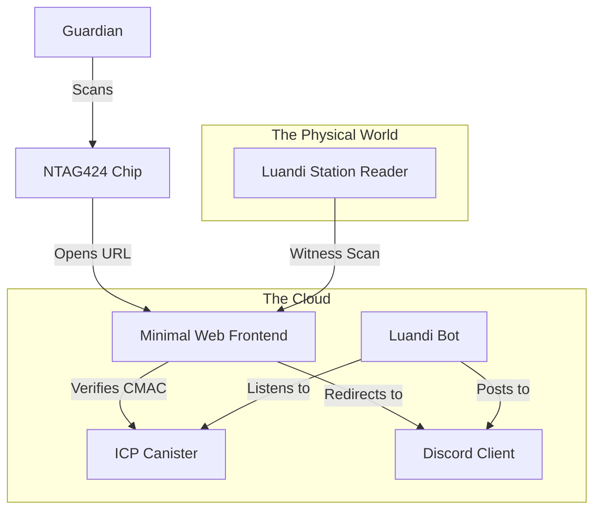

# Luandi System Architecture

## 1. High-Level Concept: "The Discord Centric Model"

While **Discord** is the primary interface for the *Humans*, a minimal **Web Frontend** is strictly necessary for the *Machines*.

### Why do we need a Web Frontend?
*   **Physics:** When a phone scans an NFC chip, it opens a URL in a browser. It cannot "open Discord directly" and execute a script.
*   **The Bridge:** The Web Frontend receives the scan parameters (UID, CMAC), validates them with the Canister, and then *redirects* the user to the appropriate Discord action or displays the success message.
*   **Conclusion:** The Web Frontend is the invisible "glue" that translates physical taps into Discord events.

---

## 2. Component Diagram

---

## 3. Detailed Component Specs

### A. The "Soul" (ICP Canister)
*   **Role:** The immutable database and logic core.
*   **State:**
    *   `Items`: Map<UID, ItemData> (Owner, XP, History).
    *   `Witnesses`: List of authorized "Station" IDs (Shops).
    *   `Sessions`: Temporary holding area for multi-item scans (Stitching).
*   **API:**
    *   `verify_scan(uid, cmac)`: Returns true/false.
    *   `register_witness_event(shop_id, item_uid)`: Records a physical presence.
    *   `transfer_guardianship(item_uid, new_guardian_discord_id)`: Updates ownership.

### B. The "Voice" (Discord Bot)
*   **Role:** The Town Crier & Notification System.
*   **Stack:** Python (`discord.py`) or JS (`discord.js`).
*   **Responsibilities:**
    1.  **Poll/Listen:** Watches the Canister for "Public Events" (Transfers, Drops).
    2.  **Broadcast:** Posts rich embed cards to `#marketplace-feed` or `#community-news`.
    3.  **DM Machinery:** Handles private confirmations. "Are you sure you want to sell Hoodie #88?"
*   **User Mapping:** Maps `Discord_ID` <-> `Canister_Principal` (if needed, or just stores Discord ID as string in Canister).

### C. The "Bridge" (Minimal Web Frontend)
*   **Role:** The URL handler for NFC taps.
*   **Stack:** Next.js (hosted on Vercel or ICP Asset Canister).
*   **Pages:**
    *   `/scan/[uid]`: The entry point.
        *   Logic: Validate URL params -> Call Canister -> If valid, show "Profile/Action Card".
    *   `/claim/[token]`: The page shown to a Buyer after a sale.
        *   button: "Login with Discord" (OAUTH).
        *   action: Link Item to Discord User.
    *   `/station/witness`: The interface for the Shopkeeper's tablet/screen.

### D. The "Anchor" (Luandi Station)
*   **Role:** The trusted hardware at the shop.
*   **Stack:** Raspberry Pi + PN532 Reader + Python Script.
*   **Behavior:**
    *   Loops waiting for a tag.
    *   When it detects a **User Tag** (Hoodie), it sends the UID to the Frontend API.
    *   When it detects a **Master Tag** (Witness Artefact), it signs a "Witness Proof" and sends it.

---

## 4. Data Flow: "The Sale"

1.  **Drop-Off (Physical):**
    *   Shopkeeper taps `Shop_Master_Tag` on Station.
    *   Seller taps `Hoodie_Tag` on Station.
    *   *Station* sends `{witness_proof, hoodie_uid}` to *Frontend*.
    *   *Frontend* calls *Canister* `register_consignment()`.
2.  **Notification (Digital):**
    *   *Bot* sees new consignment.
    *   *Bot* posts to `#sanctuary-inventory`: "**New Drop at Galaxy Shop!** Hoodie #88 - 50 CHF".
3.  **Pickup (Physical):**
    *   Buyer pays Shop.
    *   Shopkeeper taps `Shop_Master_Tag`.
    *   Buyer taps `Hoodie_Tag`.
    *   *Station* sends `{witness_proof, hoodie_uid, release=true}` to *Frontend*.
    *   *Frontend* generates a QR code on the Station Screen.
4.  **Claim (Digital):**
    *   Buyer scans QR Code with phone.
    *   Opens `luandi.io/claim/...`
    *   Buyer logs in with Discord.
    *   *Canister* updates: `Guardian = Buyer_Discord_ID`.
